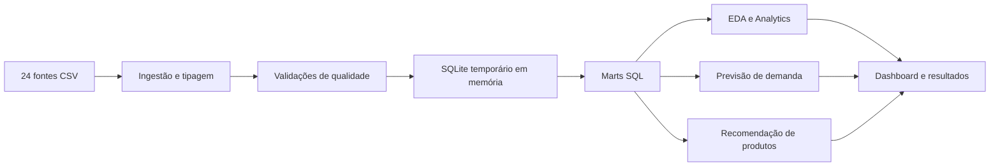

# Retail Data Platform

Projeto de portfólio que demonstra uma solução ponta a ponta de **Engenharia de Dados, Analytics e Ciência de Dados** para uma operação fictícia de varejo multicanal. A implementação integra 24 fontes relacionais em CSV, aplica validações de qualidade, constrói marts analíticos e disponibiliza análises de vendas, clientes, previsão de demanda e recomendações de produtos.

> Os nomes da organização e do processo que originou o estudo foram removidos. As fontes brutas não são distribuídas neste repositório e os resultados de clientes foram anonimizados.

## Visão geral

O projeto organiza uma base operacional fragmentada em um fluxo reproduzível:



Não há persistência de camadas intermediárias: a transformação, o banco temporário e os marts existem somente durante a execução. Apenas resultados agregados e não identificáveis são mantidos em `deliverables/`.

## Principais resultados

- 24 tabelas e 433.424 registros avaliados.
- Nenhuma chave primária duplicada ou relação órfã nas 20 chaves estrangeiras verificadas.
- Receita líquida analisada de R$ 981,1 milhões e margem bruta estimada de 41,3% no cenário fictício.
- Calendário diário completo, incluindo dias sem vendas no cálculo das médias semanais.
- Modelo de previsão para os 50 produtos de maior giro, com WAPE de 43,6% contra 52,5% do baseline sazonal.
- Recomendador item a item baseado em coocorrência, com suporte, confiança e lift para auditoria.
- Identificação de uma lacuna operacional crítica: ponto de reposição ausente em 100% dos registros de estoque.

## Componentes

### Engenharia de Dados

- Ingestão segura de pasta ou ZIP.
- Normalização de tipos e tratamento em memória.
- Auditoria de chaves, integridade referencial e identidades financeiras.
- Construção de marts SQL para vendas, clientes, produtos e calendário.
- Linhagem entre fontes e análises.

### Analytics

- KPIs comerciais, canais e evolução mensal.
- Rentabilidade e ranking de perdas por produto.
- Clientes de maior lucro acumulado, publicados com rótulos anônimos.
- Venda média por dia da semana considerando datas sem movimento.

### Ciência de Dados

- Previsão mensal com validação temporal, defasagens e médias móveis.
- Comparação objetiva com baseline sazonal por MAE e WAPE.
- Recomendação de produtos por afinidade de cestas pagas.

## Tecnologias

`Python` · `Pandas` · `NumPy` · `SQL` · `SQLite` · `scikit-learn` · `Matplotlib` · `Seaborn` · `Jinja2`

## Estrutura

```text
retail_data_platform_public/
|-- data/raw/                  # fontes não incluídas no repositório público
|-- deliverables/              # resultados agregados, gráficos e dashboard
|-- docs/                      # arquitetura, regras, metodologia e modelagem
|-- sql/                       # índices e marts analíticos
|-- src/retail_data_platform/
|   |-- data_engineering/
|   |-- eda/
|   |-- analytics/
|   |-- data_science/
|   `-- orchestration/
|-- tests/
|-- config.json
|-- requirements.txt
`-- run_pipeline.py
```

## Execução local

Crie o ambiente e instale as dependências:

```powershell
python -m venv .venv
.venv\Scripts\python -m pip install -r requirements.txt
```

Disponibilize as 24 fontes compatíveis em `data/raw/` ou informe uma pasta/ZIP externo:

```powershell
.venv\Scripts\python run_pipeline.py
.venv\Scripts\python run_pipeline.py --source "C:\caminho\fontes_csv"
.venv\Scripts\python run_pipeline.py --source "C:\caminho\fontes.zip"
```

## Testes

```powershell
python -m unittest discover -s tests -v
```

Os testes dos resultados públicos funcionam sem as fontes. As reconciliações que dependem das tabelas completas são ignoradas quando os 24 CSVs não estão presentes.

## Privacidade e publicação

- CSVs originais e dados pessoais não fazem parte da versão pública.
- Rankings de clientes utilizam rótulos como `Cliente 01`.
- O contexto empresarial foi generalizado para varejo multicanal fictício.
- O histórico da avaliação, respostas numeradas e arquivos de submissão foram removidos.

Consulte [docs/PRIVACY.md](docs/PRIVACY.md) antes de publicar novas saídas.

## Limitações

- O custo utilizado é o custo cadastral atual, não o custo histórico por lote.
- Frete, impostos efetivos e despesas operacionais não estão disponíveis.
- A previsão apoia decisões, mas não substitui política de estoque, lead time e nível de serviço.
- Recomendações de baixa frequência exigem corte mínimo de suporte e validação por teste A/B.

## Materiais

- [Dashboard executivo](deliverables/DASHBOARD_EXECUTIVO.pdf)
- [Síntese técnica e analítica](deliverables/PROJECT_SUMMARY.md)
- [Arquitetura](docs/ARCHITECTURE.md)
- [Metodologia e limitações](docs/METODOLOGIA.md)
- [Texto para o Google Sites](PORTFOLIO_SITE.md)

